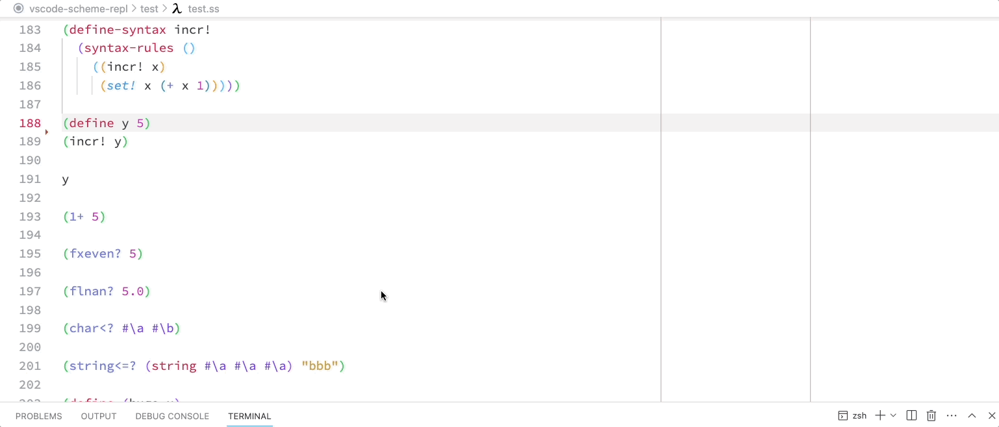

# Chez Scheme REPL for Visual Studio Code

[](https://github.com/Release-Candidate/vscode-scheme-repl/actions/workflows/test.yml)
[](https://github.com/Release-Candidate/vscode-scheme-repl/actions/workflows/lint.yml)
[](https://github.com/Release-Candidate/vscode-scheme-repl/actions/workflows/release.yml)
[](https://marketplace.visualstudio.com/items?itemName=release-candidate.vscode-scheme-repl)
[](https://marketplace.visualstudio.com/items?itemName=release-candidate.vscode-scheme-repl)
[](https://marketplace.visualstudio.com/items?itemName=release-candidate.vscode-scheme-repl)
[](https://open-vsx.org/extension/Release-Candidate/vscode-scheme-repl)


- [Features and drawbacks](#features-and-drawbacks)
  - [Drawbacks](#drawbacks)
- [Getting started](#getting-started)
  - [Dependencies](#dependencies)
    - [Suggested Additional VS Code Extensions](#suggested-additional-vs-code-extensions)
  - [Installation](#installation)
  - [Keybindings](#keybindings)
  - [Commands](#commands)
  - [Supported Source File Extensions](#supported-source-file-extensions)
- [Configuration](#configuration)
- [VS Code Scheme specific configuration](#vs-code-scheme-specific-configuration)
  - [My Configuration as seen in the Images](#my-configuration-as-seen-in-the-images)
- [Changes](#changes)
- [Contributing](#contributing)
- [License](#license)

## Features and drawbacks

- Syntax highlighting in source files and Markdown code blocks (using language identifier `scheme`).
- Hover with documentation of all Chez Scheme identifiers (works in comments too).

- Autocompletion with documentation of all Chez Scheme and local identifiers (works in comments too).

- Interactive REPL pane to the side of the editor, with commands to send code to the REPL (see [Commands](#commands)).

- Inline evaluation of expressions (see [Commands](#commands)).

- Macro expansion (see [Commands](#commands)).

- Checking for syntax errors on save (or by calling the command, see [Commands](#commands))

- All commands available in (right-click) context menus.
- Add [Keybindings](#keybindings)

### Drawbacks

- The datum comment `#;` only comments out until the first closing bracket. I'd rather have wrong comment syntax highlighting than no indication at all.
- Syntax highlighting of complex numbers is done in a simple way and does not recognize complex numbers with `NAN`s or `INF`s.
- The REPL pane is left empty on restart of VS Code and has to be manually closed. I do not know of a way to automatically close that on exit.
- Inline evaluation can only show a single line because VA Code cannot display more than one line of a "text decoration".

## Getting started

### Dependencies

- Visual Studio Code version 1.65 (February 2022) or higher
- [Chez Scheme](https://github.com/cisco/chezscheme). For Mac OS use the [Racket version of Chez Scheme](https://github.com/racket/ChezScheme)

#### Suggested Additional VS Code Extensions

- Structural editing (Paredit): [Strict Paredit](https://marketplace.visualstudio.com/items?itemName=ailisp.strict-paredit)
- To display errors inline in the source: [Error Lens](https://marketplace.visualstudio.com/items?itemName=usernamehw.errorlens)

### Installation

Either

- install the extension directly from the Visual Studio Code Marketplace [Chez Scheme REPL](https://marketplace.visualstudio.com/items?itemName=release-candidate.vscode-scheme-repl)
- install the extension directly from the Open VSX Registry [Chez Scheme REPL](https://open-vsx.org/extension/Release-Candidate/vscode-scheme-repl)
- or download the extension from the [latest release at GitHub](https://github.com/Release-Candidate/vscode-scheme-repl/releases/latest)
- or build the extension yourself by cloning the [GitHub Repository](https://github.com/Release-Candidate/vscode-scheme-repl) and running `yarn install` and `yarn package` in the root directory of the cloned repo.

### Keybindings

- Inline evaluate the s-expression to the left of the cursor (command: `chezScheme.evalLastSexp`):
  - Windows/Linux: `<Ctrl>+<Enter>`
  - Mac: `<Control>+<Enter>` (remark: `control` not `command`!)
- Evaluate the s-expression to the left of the cursor in the interactive REPL, start it, if it isn't running (command: `chezScheme.sendLastSexp`)
  - Windows/Linux: `<Ctrl>+<Shift>+<Enter>`
  - Mac: `<Control>+<Shift>+<Enter>` (remark: `control` not `command`!)
- Macro-expand the s-expression to the left of the cursor in the interactive REPL, start it, if is isn't running (command: `chezScheme.expandLastSexp`):
  - Windows/Linux: `<Alt>+<Enter>`
  - Mac: `<Option>+<Enter>`

### Commands

- `Chez Scheme REPL: Start REPL` (`chezScheme.startREPL`) - start a Chez Scheme REPL in a terminal pane to the side of the current active window.
- `Chez Scheme REPL: Send selected s-expression to the REPL.` (`chezScheme.sendSelectionToREPL`) - send the current selected s-expression to the REPL. Opens a new REPL window if no REPL is running.
- `Chez Scheme REPL: Send s-expression left of the cursor to the REPL.` (`chezScheme.sendLastSexp`) - send the s-expression to the left of the cursor to the REPL. Opens a new REPL window if no REPL is running.
- `Chez Scheme REPL: Send the whole current file to the REPL` (`chezScheme.sendFileToREPL`) - send the contents of the currently active source file to the REPL. Opens a new REPL window if no REPL is running.
- `Chez Scheme REPL: Eval the selected s-expression.` (`chezScheme.evalSelection`) - evaluate the selected s-expression and print the value inline after the selected s-expression.
- `Chez Scheme REPL: Eval s-expression left of the cursor.` (`chezScheme.evalLastSexp`) - evaluate the s-expression to the left of the cursor and print the value inline after this s-expression.
- `Chez Scheme REPL: Expand all macros in the selected s-expression.` (`chezScheme.expandSelection`) - expand all macros in the selected s-expression in the REPL. Opens a new REPL window if no REPL is running.
- `Chez Scheme REPL: Expand all macros in the s-expression left of the cursor.` (`chezScheme.expandLastSexp`) - expand all macros in the s-expression to the left of the cursor in the REPL. Opens a new REPL window if no REPL is running.
- `Chez Scheme REPL: Check the current file for errors.` (`chezScheme.checkFile`) - check the current file by loading it into the REPL. Errors are shown in the `Problems` tab. Called on save of a Chez Scheme file.

### Supported Source File Extensions

The following list of extensions is recognized as a Chez Scheme source file:

- `.ss`
- `.sps`
- `.scm`
- `.sch`
- `.sls`

## Configuration

- `chezScheme.schemePath` - Path to the Chez Scheme executable `scheme`. Can be either an absolute path or relative to the workspace root. Default: `scheme`, which works if `scheme` is in your `PATH`.
- `chezScheme.replDelay` - The delay in milliseconds `ms` to wait after starting a terminal for the interactive REPL until sending sources to it. Default: 1000ms, 1s.
- `chezScheme.waiterPrompt` - The string to display as an interactive REPL prompt. Default: `λ>`.

## VS Code Scheme specific configuration

The extension adds the following Scheme specific configuration, which you can change in the settings file:

```json
 "[scheme]": {
    "editor.insertSpaces": true,
    "editor.tabSize": 2,
    "editor.indentSize": 2,
    "editor.wordSeparators": "`()[];'\","
  }
```

You could also dim the bracket pair colors, but sadly only global for all file types and languages:

```json
"workbench.colorCustomizations": {
        "editorBracketHighlight.foreground1": "#0095ff6a",
        "editorBracketHighlight.foreground2": "#cc00ff71",
        "editorBracketHighlight.foreground3": "#32833877",
        "editorBracketHighlight.foreground4": "#ff003768",
        "editorBracketHighlight.foreground5": "#6066078e",
        "editorBracketHighlight.foreground6": "#ff99008f",
        "editorBracketHighlight.unexpectedBracket.foreground": "#ff0000",
    },
```

### My Configuration as seen in the Images

- Color theme: [Bluloco Light Theme Italic](https://github.com/uloco/theme-bluloco-light)
- Inline error messages: [Error Lens](https://github.com/usernamehw/vscode-error-lens)
- Colorized brackets: enable `Editor › Bracket Pair Colorization: Enabled`.

```json
 "editor.bracketPairColorization.enabled": true,
```

- Do not change bracket color if the bracket type changes: enable `Editor › Bracket Pair Colorization: Independent Color Pool Per Bracket Type`.

```json
"editor.bracketPairColorization.independentColorPoolPerBracketType": true,
```

## Changes

See file [CHANGELOG.md](CHANGELOG.md).

## Contributing

See file [CONTRIBUTING.md](CONTRIBUTING.md)

## License

Chez Scheme REPL for Visual Studio Code is licensed under MIT license. See file [LICENSE](LICENSE).

The documentation of the Chez Scheme identifiers is automatically generated from *Chez Scheme Version 9 User's Guide*. *Chez Scheme Version 9 User's Guide* is licensed under the Apache License Version 2, see [https://cisco.github.io/ChezScheme/csug9.5/canned/copyright.html](https://cisco.github.io/ChezScheme/csug9.5/canned/copyright.html)
